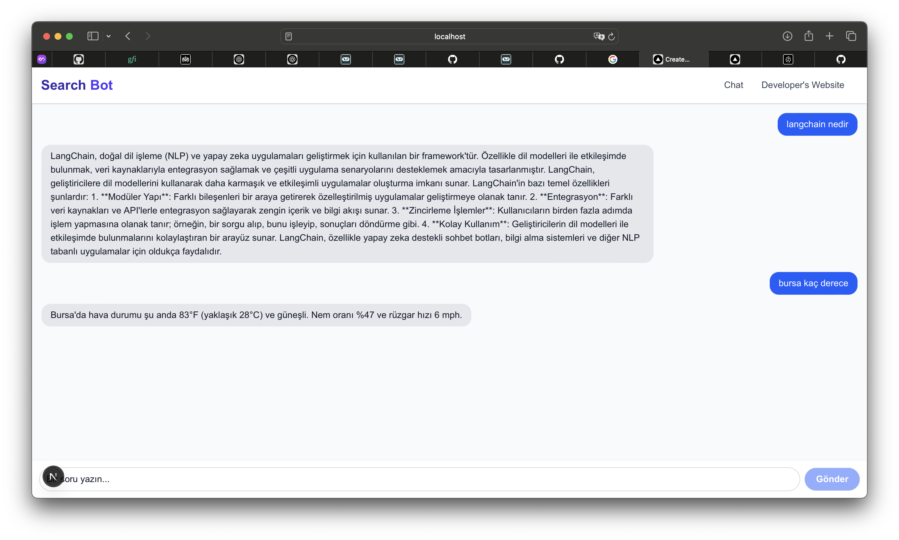

# 🔍 SearchAgent – LangChain + SerpAPI + Streaming Agent (Next.js + TypeScript)

**SearchAgent**, LangChain'in güçlü Agent altyapısını kullanarak gerçek zamanlı reasoning adımlarını canlı olarak frontend'de gösterebilen bir AI uygulamasıdır. OpenAI ve SerpAPI entegrasyonu sayesinde, kullanıcı sorularını adım adım işleyip dış veri kaynaklarını kullanarak cevap üretir.



## 🧠 Özellikler

- **LangChain Agent Executor**: Gelişmiş karar verme ve tool kullanım zinciri.
- **SerpAPI Tool**: Google üzerinden güncel web aramaları.
- **OpenAI Chat Model**: Ajanın düşünme ve cevaplama sürecini yönetir.
- **Streaming Yanıtlar**: Agent’ın reasoning süreci frontend’e adım adım iletilir.
- **Next.js API Route**: Edge-ready backend yapısı.
- **TypeScript ile Güçlü Tip Kontrolü**.

---

## 📦 Proje Yapısı

```bash
.
├── app/
│   └── api/
│       └── agent/route.ts         # Agent'in stream ettiği backend endpoint
├── components/
│   └── Chat.tsx                   # Stream edilen reasoning loglarını frontend'de gösteren chat UI
├── lib/
│   └── agent.ts                   # LangChain AgentExecutor tanımı
├── utils/
│   └── stream.ts                  # Streaming için yardımcı fonksiyonlar
├── public/
│   └── demo.png                   # Uygulama demosu
├── .env.example                   # Gerekli API anahtarları için ortam değişkenleri
└── README.md
⚙️ Kurulum

1. Repo’yu klonla
git clone https://github.com/ceyhunemre0/SearchAgent.git
cd SearchAgent
2. Bağımlılıkları yükle
pnpm install
pnpm kurulu değilse: npm install -g pnpm
3. Ortam Değişkenlerini Ayarla
.env.example dosyasını kopyalayarak .env oluştur:

cp .env.example .env
.env dosyasına aşağıdaki anahtarları ekle:

OPENAI_API_KEY=your_openai_key
SERPAPI_API_KEY=your_serpapi_key
4. Geliştirme Sunucusunu Başlat
pnpm dev
Uygulama http://localhost:3000 adresinde çalışacaktır.

💡 Nasıl Çalışır?

Kullanıcı, frontend'deki input alanına doğal dilde bir soru yazar.
app/api/agent/route.ts dosyasındaki endpoint, LangChain AgentExecutor’ü tetikler.
Agent, SerpAPI gibi tool’ları adım adım kullanarak reasoning yapar.
Bu reasoning çıktıları anlık olarak ReadableStream ile frontend’e stream edilir.
Kullanıcı, modelin düşündüğü her adımı canlı olarak görebilir.
🛠 Kullanılan Teknolojiler

🧠 LangChain TS
🧪 OpenAI Chat Models
🔍 SerpAPI
⚙️ Next.js
📘 TypeScript
⚡️ Streaming API (ReadableStream)
📸 Ekran Görüntüsü

📄 Lisans

Bu proje MIT lisansı ile lisanslanmıştır.

✨ Geliştiren

Ceyhun Emre